<h1 align="center">
  
</h1>

  <b>17-year-old tool builder, reverse-engineer, and automation enthusiast from Ashuganj, Bangladesh.</b> 
  I work across the full stack — from low-level Windows internals and game memory to web apps, Discord bots, and AI tooling.

  
  
  

  

## 🚀 About Me

- 🔬 **Reverse Engineer** — IL2Cpp dump analysis, dnSpy, PE inspection, memory editing, offset extraction
- 🪟 **Windows Developer** — DLL injection, Dear ImGui menus (preferring custom dark themes and glow effects), WinAPI, capture bypasses, auto-updaters
- 🔐 **Security Researcher** — Malware analysis, vault encryption (AES-256), signature cloning, token research, anti-cheat systems
- 🌐 **Full-Stack Dev** — TypeScript / Next.js frontends, Python & Node.js backends, PHP e-commerce
- 🤖 **Automation Builder** — Social media pipelines, manga/manhwa recap tooling, video upscaling and VFX processing, TTS
- 💬 **Discord Tool Maker** — Server cloners, anti-prune bots, VC managers, message forwarders, RPC spoofers
- 📦 **60+ repos** spanning 9 languages, countless domains — most of it private, all of it intentional

---

## 💻 Languages & Tools

> **Real language distribution (including private repos):**
> `Python 28%` · `C++ 22%` · `C 14%` · `C# 13%` · `TypeScript 11%` · `JavaScript 7%` · `Other 5%`

---

## 🏗️ What I Build

| Domain | Focus Areas |
|--------|-------------|
| 🔬 **Reverse Engineering** | IL2Cpp dump analysis, dnSpy MCP server, PE inspection, offset extraction, cross-referencing |
| 🪟 **Windows Tools** | DLL injection, ImGui menus, WinAPI, capture hiding, executable auto-updaters |
| 🔐 **Security Research** | Analysis tooling, AES-256 vaults, signature cloning, token extraction research, anti-cheat |
| 🌐 **Web & APIs** | Next.js/TS apps, PHP top-up stores, auth systems, REST APIs, e-shops |
| 🤖 **Automation** | Google Maps automation, YouTube→Instagram pipelines, video captioning, manga tooling |
| 💬 **Discord Tools** | Server cloners, anti-prune bots, VC managers, message forwarders, fake RPC clients |
| 🎮 **Game Tooling** | External/internal modifications, emulator bypasses, interface overlays |

---

## ⭐ Featured Projects

<table>
<tr>
<td width="50%">

### 🔬 [DnSpyMCP](https://github.com/rabbanyhmm/DnSpyMCP)
A powerful MCP server for .NET reverse engineering. **31 tools** for deep assembly inspection, IL2Cpp dump analysis, cross-referencing, and network patching.

`C#` · `reverse-engineering` · `il2cpp` · `dnspy` · MIT

</td>
<td width="50%">

### 🪟 [WindowCaptureHider](https://github.com/rabbanyhmm/WindowCaptureHider)
Lightweight Windows DLL that hides all top-level windows from OBS, Snipping Tool, and other capture utilities via `SetWindowDisplayAffinity`.

`C++` · `windows` · `dll` · ⭐ 23 · 🍴 5 · AGPL-3.0

</td>
</tr>
<tr>
<td width="50%">

### 🔃 [DiscordServerClonner](https://github.com/rabbanyhmm/DiscordServerClonner)
Clone servers, back up stickers & emojis, fetch server info, and validate tokens — all without requiring admin permissions.

`Python` · `discord` · `automation` · ⭐ 1 · 🍴 7 · MIT

</td>
<td width="50%">

### 🎬 [VideoCaptionBurner](https://github.com/rabbanyhmm/VideoCaptionBurner)
Generate, style, and burn subtitles into videos with fine-grained control over timing, formatting, and layout.

`Python` · `video` · `subtitles` · `ffmpeg` · ⭐ 1 · MIT

</td>
</tr>
</table>

---

## 📊 GitHub Stats

   
   
  

---

## 🏆 GitHub Trophies

  

---

## 📈 Visitor Count

  
  &nbsp;
  

### ✍️ Random Dev Quote

  

---

<picture>
  <source media="(prefers-color-scheme: dark)" srcset="https://github.com/rabbanyhmm/rabbanyhmm/raw/refs/heads/output/github-snake-dark.svg" />
  <source media="(prefers-color-scheme: light)" srcset="https://github.com/rabbanyhmm/rabbanyhmm/raw/refs/heads/output/github-snake.svg" />
  
</picture>

  Built with intent. Most of the good stuff is private. 🔒

