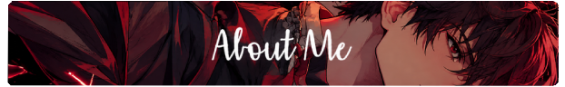

#

 
 

 
  
- Name: **Rabbany** (You can find me as `rabbanyhmm`)

- A tool builder and reverse engineer, broadcasting from somewhere beyond Earth :3

- Good with **C++**, **C#**, **Python** and **TypeScript**.

- Familiar with **Windows internals**, **IL2Cpp / dnSpy** and **Linux**.

- 60+ repos across 9 languages — most private, all intentional.

 

🎵 Play music

<!--<video src="https://github.com/user-attachments/assets/df22daac-0457-4eca-ba89-2b4a16d5d43a" width="320" height="180" controls></video>-->

<video src="https://github.com/user-attachments/assets/9f410ba5-4887-490f-a1f3-df4fafcf3e04" width="320" height="48" controls></video>

 

 
 
  
- 📗 [***rabbanyhmm/DnSpyMCP***](https://github.com/rabbanyhmm/DnSpyMCP)  
  An MCP server for .NET reverse engineering with 31 inspection tools.
- 📘 [***rabbanyhmm/WindowCaptureHider***](https://github.com/rabbanyhmm/WindowCaptureHider)  
  A Windows DLL that hides top-level windows from OBS and other capture utilities.
- 📙 [***rabbanyhmm/DiscordServerClonner***](https://github.com/rabbanyhmm/DiscordServerClonner)  
  Clone servers, back up stickers and emojis, and validate tokens without admin.
 

<picture>
  <source media="(prefers-color-scheme: dark)" srcset="https://github.com/rabbanyhmm/rabbanyhmm/raw/refs/heads/output/github-snake-dark.svg" />
  <source media="(prefers-color-scheme: light)" srcset="https://github.com/rabbanyhmm/rabbanyhmm/raw/refs/heads/output/github-snake.svg" />
  
</picture>
  
 *“Built with intent. Most of the good stuff is private. 🔒” – Rabbany* 

